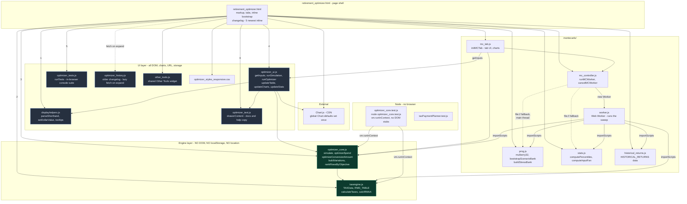
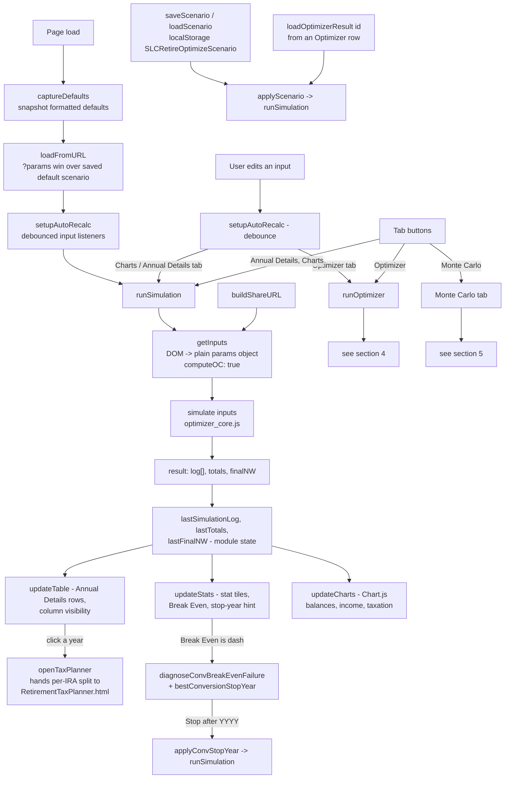
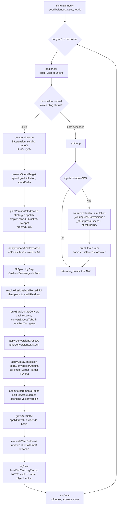
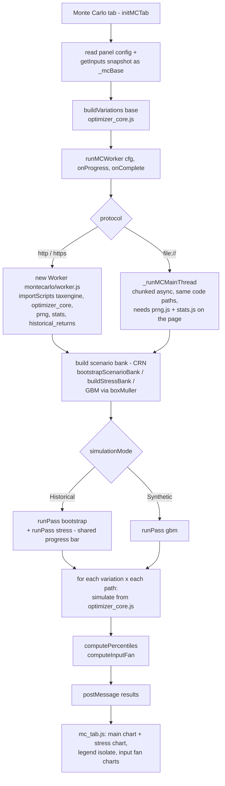

# Retirement Optimizer - Architecture

Visual reference for `retirement_optimizer.html` and everything it loads. Three layers:

1. [Module dependency graph](#1-module-dependency-graph) - who loads whom, and the no-DOM boundary
2. [Runtime data flow](#2-runtime-data-flow) - page load, recalc, render
3. Feature call-flows - [`simulate()` year pipeline](#3-simulate-per-year-pipeline), [Optimizer sweep and Optimize Conversions](#4-runoptimizer--optimize-conversions), [Monte Carlo](#5-monte-carlo)

Plus a [file reference table](#6-file-reference) with the entry points that matter.

There is no build step. Every file is a plain classic script sharing one global scope, loaded in
order by `<script>` tags. Cache-busting is a manual `?v=` token on each tag.

---

## 1. Module dependency graph

**The contract that matters:** `optimizer_core.js` and `taxengine.js` touch no DOM, no
`localStorage`, no `location` - at load time or runtime. That is what lets the same engine run in
three places: the page, the Monte Carlo worker via `importScripts`, and Node via `vm.runInContext`.
Break it and the worker and the test suite both die.

`getInputs()` in `optimizer_ui.js` is the single DOM-to-params bridge. Nothing else reads inputs.

---

## 2. Runtime data flow

Recalculation is guarded by hashes: `runOptimizer()` compares a JSON hash of `getInputs()` plus the
two search checkboxes against `_lastOptimizerHash` and re-renders the cached table instead of
re-sweeping. Monte Carlo does the same with `_lastMCHash`.

---

## 3. simulate() per-year pipeline

`simulate(inputs)` in `optimizer_core.js` loops one year at a time. Each step is its own top-level
function taking `(sim, yr)`, so the order below is literally the order in the loop body.

Break Even and Opp. Cost are a **full second simulation** with conversions removed, not a per-dollar
approximation. `cfRefundIRA()` puts the suppressed withdrawals back into the IRA with a fixed-point
tax recompute so the counterfactual pays its own larger RMD and IRMAA bills later.

---

## 4. runOptimizer + Optimize Conversions

```mermaid
flowchart TD
    CLICK["Optimizer tab or input change"] --> RO["runOptimizer"]
    RO --> BASE["base = getInputs<br/>force extraConversionAmount = 0<br/>clear convEndYear / convEndMode<br/>so the sidebar cannot leak into the sweep"]
    BASE --> HASH{"hash == _lastOptimizerHash<br/>and results cached?"}
    HASH -->|yes| RENDER
    HASH -->|no| SWEEP

    subgraph SWEEP["Strategy sweep - addResult per arm"]
        S1["propwd - proportional +%"]
        S2["fixed - Reduce IRA in N years, 1..30"]
        S3["bracket - fill fed bracket / IRMAA ceiling / ACA cliff"]
        S4["fixedpct - IRA Draw %"]
        S5["ordered, Guyton-Klinger"]
        S6["cyclic brokerage arms"]
    end
    SWEEP -->|one simulate per arm| ROWS["results[] - one row per arm<br/>feasibility flags:<br/>bracket overage, ACA breach,<br/>eitherOnMedicareAtStart"]

    ROWS --> SPENDQ{"Optimize Spend checked?"}
    SPENDQ -->|yes| SPEND["optimizeSpend / optimizeSpendDown<br/>binary search on spendGoal<br/>gkSpendStable guard"]
    SPENDQ -->|no| SCORE1
    SPEND --> SCORE1["_scoreRows -> baselineScoreOf<br/>after-tax wealth + spendable, today's dollars"]

    SCORE1 --> CONVQ{"Optimize Conversions checked?"}
    CONVQ -->|no| SCORE2
    CONVQ -->|yes| POOL["selectConversionCandidates rows, 12<br/>family-diversified, _baselineScore ranked<br/>not just top-5 by final net worth"]

    POOL --> OCA["optimizeConversionAmount<br/>$25k sweep on extraConversionAmount"]
    OCA -->|found| CONVROW["add ⇌ row"]
    OCA -->|nothing helps| TL["bestTimeLimitedConversion<br/>convert-then-stop, capped at 6 candidates"]
    TL -->|found| CONVROW2["add ⇌ row tagged ⏹YYYY<br/>carries _convEndYear"]
    CONVROW --> BEROW["one extra simulate with computeOC<br/>-> Break Even column"]
    CONVROW2 --> BEROW
    BEROW --> SCORE2["_scoreRows again - pure arithmetic,<br/>no further simulate calls"]

    SCORE2 --> RANK["rankRowsByObjective rows, objKey, rate<br/>taxflex - default, networth, widowrmd,<br/>mintax, maxspend, maxroth, balanced"]
    RANK --> RENDER["renderOptimizerTable<br/>Rank column, sortOptimizerBy,<br/>toggleInfeasibleRows"]
    RENDER --> BANNERS["renderSpendOptimizerBanner<br/>renderConvOptBanner<br/>lowestBreakEvenHeirsRate on demand"]
    RENDER --> LOADROW["click a row -> loadOptimizerResult id<br/>restores strategy, extra conversion,<br/>cyclic / ceiling settings, _convEndYear"]
    LOADROW --> RS["runSimulation - single-scenario tabs"]
```

Two things to keep straight here:

- The sidebar's **Extra Annual Roth Conversion** and **Conversion Stop Year** are explicitly cleared
  off `base` before the sweep. Without that, every family silently inherits them and the whole table
  is wrong.
- `renderOptimizerTable()` re-runs on objective change without re-simulating. Objective changes
  reorder and re-baseline only; the numbers never move.

---

## 5. Monte Carlo

The worker propagates its own `?v=` cache-bust token to every `importScripts` call, otherwise a
refreshed worker can pull a stale `optimizer_core.js`.

---

## 6. File reference

| File | Layer | Key entry points |
| --- | --- | --- |
| `retirement_optimizer.html` | page | tab buttons, inline bootstrap, changelog - 5 newest inline |
| `taxengine.js` | engine | `TAXData`, `RMD_TABLE`, `calculateTaxes`, `calcIRMAA`, `getIRMAATier`, `calculateProgressive`, `calculateTaxableSocialSecurity`, `getQCDLimit` |
| `optimizer_core.js` | engine | `simulate`, year steps `beginYear` .. `endYear`, `optimizeSpend`, `optimizeSpendDown`, `optimizeConversionAmount`, `bestTimeLimitedConversion`, `bestConversionStopYear`, `breakEvenHeirsRate`, `lowestBreakEvenHeirsRate`, `selectConversionCandidates`, `baselineScoreOf`, `rankRowsByObjective`, `buildVariations`, `calculateWithdrawals`, `computeBracketCeiling`, `splitPreferLarger` |
| `optimizer_ui.js` | UI | `getInputs`, `runSimulation`, `runOptimizer`, `renderOptimizerTable`, `loadOptimizerResult`, `updateTable`, `updateStats`, `updateCharts`, `openTaxPlanner`, `buildShareURL`, `loadFromURL`, `saveScenario`, `applyScenario`, `setOptObjective`, `applyConvStopYear` |
| `displayhelpers.js` | UI | `DisplayHelpers.setDollarValue`, `parseShorthand`, formatting and tooltip helpers |
| `optimizer_text.js` | UI | `drawerContent` - How to Use, Documentation, FAQ copy |
| `optimizer_tests.js` | UI | `runTests` - in-browser console suite |
| `other_tools.js` | UI | shared Other Tools widget across all pages |
| `doclinks.js` | UI | `DocLinks.docHref` - maps `.md` hrefs to the `.html` pages Pages generates |
| `montecarlo/mc_tab.js` | MC | `initMCTab`, chart rendering, `_mcBase` / `_lastMCHash` |
| `montecarlo/mc_controller.js` | MC | `runMCWorker`, `cancelMCWorker`, `_runMCMainThread` file:// fallback |
| `montecarlo/worker.js` | MC | `runPass`, bank build + variation sweep |
| `montecarlo/prng.js` | MC | `mulberry32`, `boxMuller`, `bootstrapScenarioBank`, `buildStressBank`, `applyBearStartOverlay` |
| `montecarlo/stats.js` | MC | `computePercentiles`, `computeInputFan` |
| `montecarlo/historical_returns.js` | MC | `HISTORICAL_RETURNS` |
| `optimizer_core.test.js` | test | `node optimizer_core.test.js` - loads engine via `vm.runInContext` |
| `doclinks.test.js` | test | `node doclinks.test.js` - `docHref()` mapping table |
| `_includes/head-custom.html` | docs | Jekyll theme hook: CSS + `doclinks.js` for rendered `.md` pages |

### Shared globals crossing file boundaries

| Global | Owner | Read by |
| --- | --- | --- |
| `STATEname` | `optimizer_core.js` - set on every `simulate()` | `taxengine.js` state logic |
| `simulationCount` | `optimizer_core.js` | `runOptimizer()` resets and reports it |
| `SPEND_SEARCH_MIN_DELTA` | `optimizer_core.js` | `renderSpendOptimizerBanner()` |
| `OptimizerState` | `optimizer_ui.js` | table render, objective ranking, conversion banner |
| `lastSimulationLog` / `lastTotals` / `lastFinalNW` | `optimizer_ui.js` | chart toggles, current-dollars view, tax planner handoff |
| `NERD_KNOBS` | `optimizer_ui.js` | advanced controls, MC nerd panels, optimizer sweep dimensions |

### Conventions

- **Cache busting:** bump the `?v=` token on the changed file's `<script>` or `<link>` tag. The CSS
  tag needs it too - easy one to forget.
- **Chart.js:** tooltip colors, padding, and `labelColor` come from the one global `Chart.defaults`
  block after the CDN import. Never set them per chart.
- **Changelog:** 5 newest entries inline in the HTML, each linking to its section of
  `optimizer_changelog.md`, which holds the full write-up of every release. Adding an entry means
  dropping the sixth-oldest `<li>`; its detail is already in the `.md`, so nothing is lost.
- **Docs rendering:** GitHub Pages runs Jekyll (default theme `jekyll-theme-primer`) over this repo
  on every push to `main` and publishes each `.md` as HTML at its `.html` URL, so
  `optimizer_changelog.html` exists on the live site without being a file in the repo. `README.md`
  becomes `/`, not `README.html`. Jekyll skips dot-directories, so nothing under `.planning/` is
  published in any form - link those at their GitHub blob URL. `_includes/head-custom.html` is the
  theme's one customization hook (there is no `_config.yml` on purpose). Jekyll runs only on
  GitHub's servers, so `file://` and a local `http.server` have no `.html` for any `.md`: hrefs in
  the markup stay `.md` and `doclinks.js` upgrades them at runtime when the origin is not local.
  **Never add a `.nojekyll` file** - it would 404 every docs URL on the site.
