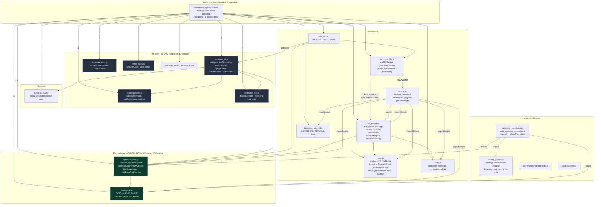
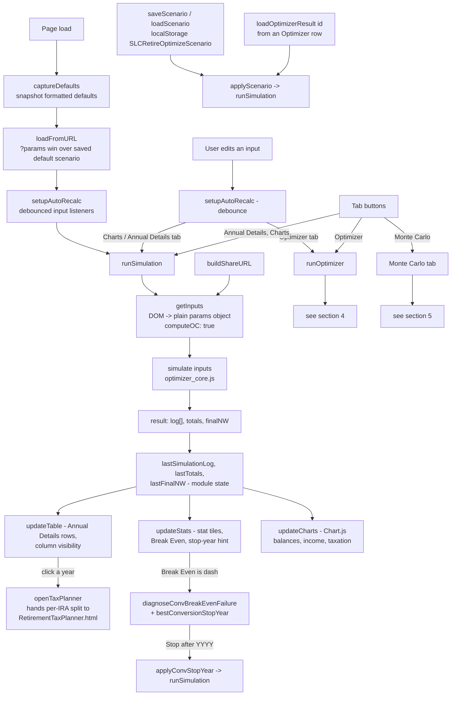
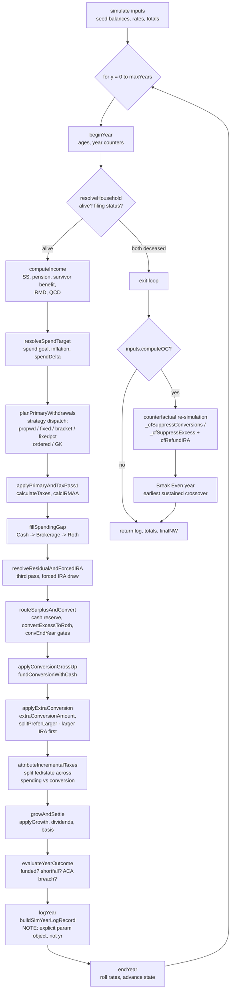
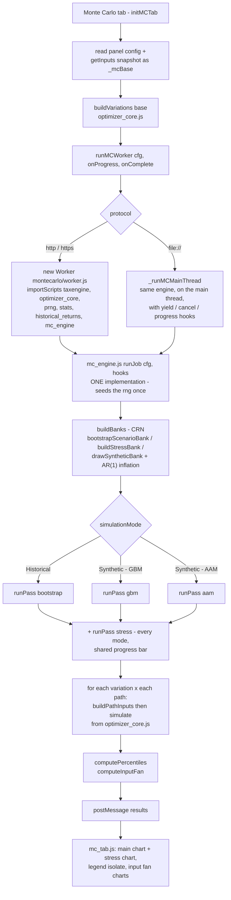

# Retirement Optimizer - Architecture

Visual reference for `retirement_optimizer.html` and everything it loads. Three layers:

1. [Module dependency graph](#1-module-dependency-graph) - who loads whom, and the no-DOM boundary
2. [Runtime data flow](#2-runtime-data-flow) - page load, recalc, render
3. Feature call-flows - [`simulate()` year pipeline](#3-simulate-per-year-pipeline), [Optimizer sweep and Optimize Conversions](#4-runoptimizer--optimize-conversions), [Monte Carlo](#5-monte-carlo)

Plus a [file reference table](#6-file-reference) with the entry points that matter.

There is no build step. Every file is a plain classic script sharing one global scope, loaded in
order by `<script>` tags. Cache-busting is a manual `?v=` token on each tag.

---

## 1. Module dependency graph



**The contract that matters:** `optimizer_core.js` and `taxengine.js` touch no DOM, no
`localStorage`, no `location` - at load time or runtime. That is what lets the same engine run in
three places: the page, the Monte Carlo worker via `importScripts`, and Node via `require()`.
Break it and the worker and the test suite both die.

`getInputs()` in `optimizer_ui.js` is the single DOM-to-params bridge. Nothing else reads inputs.

---

## 2. Runtime data flow



Recalculation is guarded by hashes: `runOptimizer()` compares a JSON hash of `getInputs()` plus the
two search checkboxes against `_lastOptimizerHash` and re-renders the cached table instead of
re-sweeping. Monte Carlo does the same with `_lastMCHash`.

---

## 3. simulate() per-year pipeline

`simulate(inputs)` in `optimizer_core.js` loops one year at a time. Each step is its own top-level
function taking `(sim, yr)`, so the order below is literally the order in the loop body.



Break Even and Opp. Cost are a **full second simulation** with conversions removed, not a per-dollar
approximation. `cfRefundIRA()` puts the suppressed withdrawals back into the IRA with a fixed-point
tax recompute so the counterfactual pays its own larger RMD and IRMAA bills later.

---

## 4. runOptimizer + Optimize Conversions


Two things to keep straight here:

- The sidebar's **Extra Annual Roth Conversion** and **Conversion Stop Year** are explicitly cleared
  off `base` before the sweep. Without that, every family silently inherits them and the whole table
  is wrong.
- `renderOptimizerTable()` re-runs on objective change without re-simulating. Objective changes
  reorder and re-baseline only; the numbers never move.

---

## 5. Monte Carlo



The worker propagates its own `?v=` cache-bust token to every `importScripts` call, otherwise a
refreshed worker can pull a stale `optimizer_core.js`.

**One engine, two shells (v11.161F).** `worker.js` and `mc_controller.js` each used to hold a full
copy of the run, and they had drifted - the controller had per-path progress and cancellation the
worker never got. Both now call `runJob()` and differ only in the hooks they pass: the worker passes
a throttled progress callback and nothing else, the main thread passes progress plus `shouldCancel`
and a 16ms `yieldIfDue`. Nothing about the model can change for one caller and not the other.

**Nothing in any test suite loads `worker.js` or `mc_controller.js`** - one opens with
`importScripts`, the other is a page script - and `MC_GOLDEN` pins `buildVariations()` enumeration,
not a single simulated return. A Monte Carlo refactor therefore needs its own evidence:
`.planning/retirement-optimizer/p71_probe/` loads both files into a `vm` context and hashes a
fixed-seed run in all three modes, to be run against the working tree and a staged copy of the
previous commit. The suite does cover `mc_engine.js` directly (end-to-end in all three modes, CRN
determinism, stress path counts, cancellation).

**CRN discipline.** `runJob` seeds the returns stream once and both passes share it, so `runPass`
takes the rng as a parameter. Inflation draws come from a *separate* stream keyed by
`INFLATION_STREAM_XOR`, and each year's inflation shock is correlated with that year's return shock
through `correlatedNormal` - statistically entangled, but never reading each other's generator, so
retuning the inflation knobs leaves every return draw bit-identical. Any change that conditionally
skips a draw desynchronizes the stream from that year on; this is why Fixed Inflation sets the shock
size to zero and still makes the draw.

---

## 6. File reference

| File | Layer | Key entry points |
| --- | --- | --- |
| `retirement_optimizer.html` | page | tab buttons, inline bootstrap, changelog - 5 newest inline |
| `optimizer_styles_responsive.css` | page | the page's only stylesheet; its `?v=` token is the one most often forgotten |
| `taxengine.js` | engine | `TAXData`, `RMD_TABLE`, `calculateTaxes`, `calcIRMAA`, `getIRMAATier`, `calculateProgressive`, `calculateTaxableSocialSecurity`, `getQCDLimit` |
| `optimizer_core.js` | engine | `simulate`, year steps `beginYear` .. `endYear`, `optimizeSpend`, `optimizeSpendDown`, `optimizeConversionAmount`, `bestTimeLimitedConversion`, `bestConversionStopYear`, `breakEvenHeirsRate`, `lowestBreakEvenHeirsRate`, `selectConversionCandidates`, `baselineScoreOf`, `rankRowsByObjective`, `buildStrategyFamilies` (the strategy enumeration both sweeps share, with `MC_GRIDS` / `OPTIMIZER_GRIDS`), `buildVariations`, `calculateWithdrawals`, `computeBracketCeiling`, `splitPreferLarger` |
| `optimizer_ui.js` | UI | `getInputs`, `runSimulation`, `runOptimizer`, `renderOptimizerTable`, `loadOptimizerResult`, `updateTable`, `updateStats`, `updateCharts`, `openTaxPlanner`, `buildShareURL`, `loadFromURL`, `saveScenario`, `applyScenario`, `setOptObjective`, `applyConvStopYear` |
| `displayhelpers.js` | UI | `DisplayHelpers.setDollarValue`, `parseShorthand`, formatting and tooltip helpers |
| `optimizer_text.js` | UI | `drawerContent` - How to Use, Documentation, FAQ copy |
| `optimizer_tests.js` | UI | `runTests` - in-browser console suite |
| `other_tools.js` | UI | shared Other Tools widget across all pages |
| `doclinks.js` | UI | `DocLinks.docHref` - maps `.md` hrefs to the `.html` pages Pages generates |
| `montecarlo/mc_tab.js` | MC | `initMCTab`, chart rendering, `_mcBase` / `_lastMCHash` |
| `montecarlo/mc_controller.js` | MC | `runMCWorker`, `cancelMCWorker`, `_runMCMainThread` (file:// fallback - builds hooks, awaits `runJob`), `estimateMCMs` / `recordMCTiming` |
| `montecarlo/mc_engine.js` | MC | `runJob`, `runPass`, `buildBanks`, `buildPathInputs`, `buildStressMsg` - the model, shared by the worker and the main-thread fallback |
| `montecarlo/worker.js` | MC | shell only: `onmessage`, throttled progress, error containment |
| `montecarlo/prng.js` | MC | `mulberry32`, `boxMuller`, `bootstrapScenarioBank`, `buildStressBank`, `applyBearStartOverlay`, `drawSyntheticBank`, `syntheticReturnFromBank`, `computeNextInflation`, `correlatedNormal`, `INFLATION_STREAM_XOR` |
| `montecarlo/stats.js` | MC | `computePercentiles`, `computeInputFan` (dual-mode export since P71d) |
| `montecarlo/historical_returns.js` | MC | `HISTORICAL_RETURNS` |
| `optimizer_core.tests.js` | test | `node optimizer_core.tests.js` - loads the engine via `require()` against the dual-mode export guards, with `window`/`document`/`performance` stubbed on `globalThis` first (`:23-25`). It has not used `vm.runInContext` since `86e26fa`; the stub comment at `:21` still refers to "the old vm-based harness" |
| `sweep_golden.js` | test data | `SWEEP_BASES`, `MC_GOLDEN`, `OPT_GOLDEN` - the recorded strategy enumerations both sweeps must keep emitting. Data only, dual-mode export, `require`d by `optimizer_core.tests.js` on every run |
| `sweep_golden.gen.js` | test tool | `node sweep_golden.gen.js` - rewrites the `MC_GOLDEN` block of `sweep_golden.js` from source. Run only for a deliberate `buildVariations()` change, then read the diff |
| `sweep_golden.import.js` | test tool | `node sweep_golden.import.js <dir>` - folds a browser capture into `OPT_GOLDEN`. That half cannot be generated: the Optimizer's enumeration needs a live `getInputs()`. Capture recipe is in the file header |
| `doclinks.tests.js` | test | `node doclinks.tests.js` - `docHref()` mapping table |
| `taxPaymentPlanner.tests.js` | test | `node taxPaymentPlanner.tests.js` - covers `taxPaymentPlanner.js`, which the optimizer does not load |
| `RetirementTaxPlanner.html` | sibling page | handoff target of `openTaxPlanner()`; the only page that loads `taxPaymentPlanner.js` |
| `taxPaymentPlanner.js` | engine | `TaxPaymentPlanner.computePaymentPlan`, `getStateInfo`, `dueDateFor`, `restoreDateFor`, holiday/business-day helpers. Same no-DOM contract as the other two engine files |
| `optimizer_changelog.md` | docs | full release history; the 5 newest entries are duplicated inline in the HTML |
| `_includes/head-custom.html` | docs | Jekyll theme hook: CSS + `doclinks.js` for rendered `.md` pages |
| `.test_harnesses/` | research | investigative **scripts** that are **not** part of any suite - see the note below. Holds `.js` only. A dot-directory, so Jekyll never publishes it |
| `research/` | research | the **write-ups** those scripts produce: [`HARNESSES.md`](research/HARNESSES.md) (the index) and one `*_RESULTS.md` per study. Split out of `.test_harnesses/` on 2026-08-28 - a directory holding both the scripts and their prose was hard to scan, and the prose is worth publishing while the scripts are not |
| `.githooks/pre-commit` | test gate | runs all three `node` suites, blocks the commit on a failure or a missing suite. Install once with `sh .githooks/install` - see below |

### Where a test file belongs

Two directories, one rule, because the distinction has been asked about:

- **Repo root, beside the suite it serves** - anything `node <x>.test.js` needs in order to pass.
  `sweep_golden.js` is a *fixture*, not a study: `optimizer_core.tests.js:66` `require`s it and
  asserts against it every run, so a drift in either enumeration fails the build. `sweep_golden.gen.js`
  and `sweep_golden.import.js` are the two ways that fixture is refreshed, and `gen` rewrites
  `sweep_golden.js` in place by `__dirname`, so they stay next to it. None of the three is interim,
  profiling, or throwaway: 18 named tests assert against the goldens, and because the `require` is
  top-level, deleting the file does not lose 18 tests - it stops the whole suite from loading.
- **`.test_harnesses/`** - scripts that answer a *research question* once and are kept only so a
  finding can be re-derived (BETR trustworthiness, conversion stop-year, unified-conversion routing).
  They are not run by CI or by any `.test.js`, several run only in a browser console, and their
  output is prose rather than a pass/fail. **This directory holds `.js` only.**
- **`research/`** - where that prose lands: `research/HARNESSES.md` indexes every harness, and each
  study gets one `research/<NAME>_RESULTS.md`. A new harness writes its report here, never beside
  the script.

**Why one of these two carries a leading dot and the other does not.** Jekyll skips dot-directories
entirely, so nothing under `.test_harnesses/` is reachable on the deployed site - which is right for
a script nobody should run from a browser. The reports are the opposite: they are the deliverable, so
`research/` is published and every report is readable at `/research/<NAME>_RESULTS.html`. A link from
a published report back to its script therefore has to be an absolute GitHub blob URL, not a relative
path, or it lands on a 404.

The test that decides it: **would the suite fail without this file?** Yes goes at root; no goes in
`.test_harnesses/` (the script) and `research/` (its report).

### The pre-commit gate, and what it is compensating for

```sh
sh .githooks/install
```

Run once per clone. The hook runs all three node suites (~3.5 s) and blocks the commit on a failure,
on a **missing** suite, or on a `*.tests.js` file that exists but is not in its `suites=` list - a
renamed, deleted or unlisted suite would otherwise look identical to a green run.
`git commit --no-verify` is the deliberate escape hatch.

The hook is the guarantee; the badge is the convenience. Both now cover the same 513 tests, and they
fail independently, which is the point: the hook catches breakage at the commit, the badge catches
it at the release.

Two mechanics worth knowing before touching it, both discovered the hard way:

- **`core.hooksPath` is already pinned to an absolute path**, and `extensions.worktreeConfig` is on,
  so every worktree re-pins it in its own `config.worktree`, which outranks the repo config.
  `git config core.hooksPath .githooks` would therefore be silently ignored inside every worktree.
  `install` writes a shim at the pinned location instead; the shim execs the `.githooks/pre-commit`
  of whichever working tree is committing.
- **`.gitattributes` pins `.githooks/**` to `eol=lf`.** `core.autocrlf` is true on Windows and `sh`
  cannot execute a script whose shebang ends in CR. That pin is scoped to `.githooks/` on purpose -
  this repo has no repo-wide EOL policy, and adding one would renormalise every tracked file.

### The three test tiers, and the badge that reports them

| tier | what | when |
|---|---|---|
| 1 | `optimizer_tests.js`, 245 tests, ~55 ms | blocking, at page load |
| 2 | the three node suites, 265 fast tests | injected from `requestIdleCallback` **after** first paint |
| 3 | 3 slow tests tagged `test.slow` | node always; browser only on `?runtests` |

Tier 2 is not on the critical path and that is measured: `loadEventEnd` lands around 760 ms while the
tier-2 script requests start around 3.7 s. They are injected scripts, not `<script>` tags.

**Badge states.** `⏳` tier 1 passed, tier 2 still running · `🟢` everything passed · `🟢⚠` tier 1
passed but tier 2 could not be fetched (`file://` blocks it) · `❌` something failed ·
`❌ test counts changed` the staleness guard fired. A pending badge must never read as green - green
is a claim that everything passed, and rendering it early is the false-green this whole phase exists
to remove. Tier 2 is **opt-in per page** via `window.TIER2_PENDING`; `standalone/IncomeTaxPlanner.html`
loads the same file and does not opt in, so it keeps the original two-state badge.

**`?runtests`** forces tier 2 synchronously with the slow tests included (513 total);
**`?runtests=fast`** runs it now but keeps skipping them.

**Three things to know before adding a test:**

- **Adding a test means editing `TestTiers.EXPECTED` in `optimizer_tests.js` in the same commit.**
  The staleness guard compares the counts on disk against that object and turns the badge red on any
  drift, naming it. That friction is deliberate - it is what stops a suite being added and silently
  never run.
  **Reconcile every entry in that object, not just the one for the tool you are working on.** It is
  the single pin for all three node suites, and they belong to different tools: `taxPaymentPlanner`
  counts `RetirementTaxPlanner.html`'s suite, which the Optimizer page never loads. A Tax Payment
  Planner release on 2026-08-17 added 2 tests, left `taxPaymentPlanner: 32` alone, and turned the
  Optimizer's badge red without touching the Optimizer. The counts have a second home in the suite
  table in [.githooks/README.md](.githooks/README.md) - update that in the same commit as well.
- **`test.critical(name, fn)`** marks a regression guard for a defect that actually shipped. Those
  are printed as `✓ ★ CRITICAL <name>` and repeated in their own end-of-run block, so their status is
  readable without scrolling. Ten exist today: dividend/interest double-counting, and the state
  retirement-income exemptions including no-income-tax states.
- **`test.slow(name, fn)`** exempts a test from the browser tier only. Node always runs it. Use it on
  measurement, not suspicion - the three tagged today are 71% of the suite's runtime.

**Trap, seen for real.** The suites resolve the engine through `window.TaxEngine` / `OptimizerCore` /
`SweepGolden` rather than bare globals, because a classic script puts `function` declarations on
`globalThis` but leaves top-level `const` (`MC_GRIDS`, `OPTIMIZER_GRIDS`, `RMD_TABLE`) as global
*lexical* bindings a property lookup cannot see. Related: the engine writes wall clock into its own
output (`optimizer_core.js:928`, `:2381`, `:1739`), so the browser runner stubs `performance.now()`
for the duration of a run and restores it afterwards - without that, six byte-identity tests fail in
the browser while passing in node, on the clock rather than the engine.

### Shared globals crossing file boundaries

| Global | Owner | Read by |
| --- | --- | --- |
| `STATEname` | `optimizer_core.js` - set on every `simulate()` | `taxengine.js` state logic |
| `simulationCount` | `optimizer_core.js` | `runOptimizer()` resets and reports it |
| `SPEND_SEARCH_MIN_DELTA` | `optimizer_core.js` | `renderSpendOptimizerBanner()` |
| `OptimizerState` | `optimizer_ui.js` | table render, objective ranking, conversion banner |
| `lastSimulationLog` / `lastTotals` / `lastFinalNW` | `optimizer_ui.js` | chart toggles, current-dollars view, tax planner handoff |
| `NERD_KNOBS` | `optimizer_ui.js` | advanced controls, MC nerd panels, optimizer sweep dimensions |

### Conventions

- **Cache busting:** bump the `?v=` token on the changed file's `<script>` or `<link>` tag. The CSS
  tag needs it too - easy one to forget.
- **Chart.js:** tooltip colors, padding, and `labelColor` come from the one global `Chart.defaults`
  block after the CDN import. Never set them per chart.
- **Changelog:** 5 newest entries inline in the HTML, each linking to its section of
  `optimizer_changelog.md`, which holds the full write-up of every release. Adding an entry means
  dropping the sixth-oldest `<li>`; its detail is already in the `.md`, so nothing is lost.
- **Docs rendering:** GitHub Pages runs Jekyll (default theme `jekyll-theme-primer`) over this repo
  on every push to `main` and publishes each `.md` as HTML at its `.html` URL, so
  `optimizer_changelog.html` exists on the live site without being a file in the repo. `README.md`
  becomes `/`, not `README.html`. Jekyll skips dot-directories, so nothing under `.planning/` is
  published in any form - link those at their GitHub blob URL. `_includes/head-custom.html` is the
  theme's one customization hook (there is no `_config.yml` on purpose). Jekyll runs only on
  GitHub's servers, so `file://` and a local `http.server` have no `.html` for any `.md`: hrefs in
  the markup stay `.md` and `doclinks.js` upgrades them at runtime when the origin is not local.
  **Never add a `.nojekyll` file** - it would 404 every docs URL on the site.
